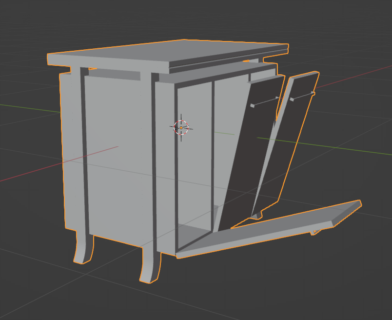
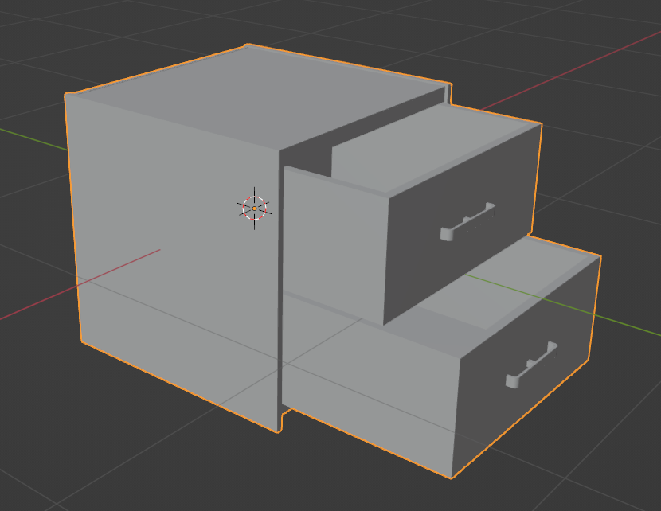

## Sapien PartNet dataset generator

See [PartNet-Mobility Dataset](https://sapien.ucsd.edu/browse) for details of dataset.

The repository use `urdfpy` and `trimesh` to sample the **mobility status** to generate the all-in-one mesh, and we provide two samples.





#### Preprocess
```bash
python preprocess_urdf.py --urdf_path=./19179
```

#### Generate
```bash
python generate_mesh.py --urdf_path=./19179
```